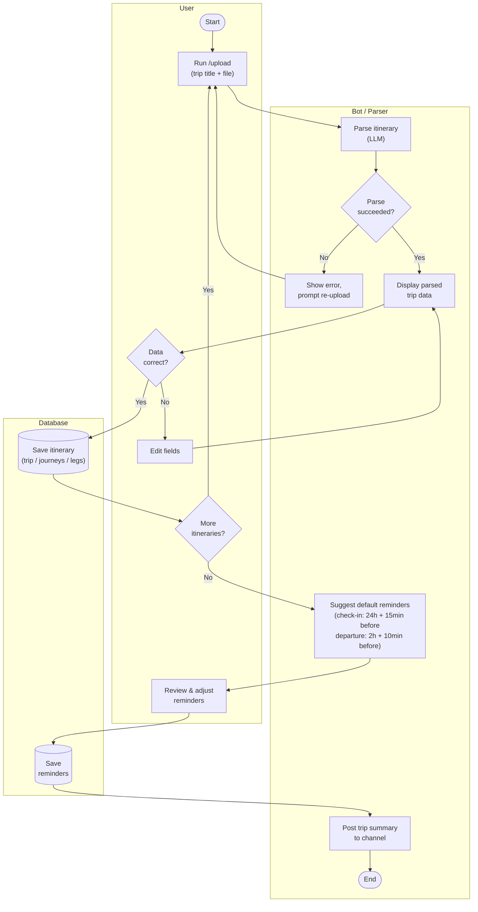

# Discord Travel Bot — Software Design Document

---

## 1. Introduction

This document describes the design of a Discord bot that parses flight itineraries and sends automated check-in and departure reminders to users. It covers requirements, system architecture, component design, data models, and user interaction flows.

### Glossary

| Term | Definition |
|------|-----------|
| **leg** | A single flight from one airport to another |
| **layover** | Elapsed time at an airport between legs |
| **journey** | One-directional travel from origin to final destination; may contain multiple legs and layovers |
| **trip** | Collection of journeys/dates under a single title |
| **itinerary** | Airline confirmation document containing all flight details; may cover the entire trip or a single journey |

---

## 2. Background & Motivation

Airlines send confirmation emails that are dense and inconsistent across carriers. Sharing flight details within a group and remembering check-in windows requires manual effort. This bot automates that: users upload their itinerary once, the bot parses it and handles reminders automatically within Discord.

---

## 3. Requirements

### 3.1 Functional Requirements

- Users interact with the bot exclusively through Discord slash commands
- Bot accepts itinerary uploads in the following formats: jpg, jpeg, png, pdf
- Itinerary parser extracts all journey and leg information without manual entry by the user
- Parsed data is confirmed with the user before being saved
- Two reminder categories are created automatically per journey upon confirmation:
  - `check_in` — fires 24 hours and 15 minutes before departure
  - `departure` — fires 2 hours and 10 minutes before departure
- Reminders are delivered via Discord DM and re-ping every `repeat_interval_minutes` until dismissed

### 3.2 Non-Functional Requirements & Constraints

- **Lightweight** — self-contained Discord bot; infrastructure is limited to the bot process and Supabase
- **Portable** — deployable to any Discord server with no per-user installation
- **Free-tier** — all external services must have a usable free tier
- **UI-agnostic core** — all non-UI logic (parsing, persistence, scheduling) must be independent of Discord; see Section 4.2

### 3.3 Non-Goals

- Real-time flight status or delay tracking
- Flight booking or purchasing
- Manual text entry of flight data
- Chrome extension, email forwarding, and calendar integrations (see Section 8)

---

## 4. System Design

### 4.1 Architecture Overview

```
Discord User
    │  slash command + attachment
    ▼
Bot Application  ──► Itinerary Parser (Claude API)
    │                      │ structured JSON
    │◄──────────────────────
    │  store
    ▼
Supabase Database
    ▲
    │  poll every minute
Reminder Service ──► Discord DM (user)
```

Three main components interact to deliver the end-to-end flow: the **Bot Application** handles all Discord I/O, the **Itinerary Parser** converts raw files into structured data, and the **Reminder Service** polls the database and fires DMs on schedule.

### 4.2 Design Principle: UI Agnosticism

All core logic — itinerary parsing, data persistence, reminder scheduling — must be implemented independently of Discord. Discord is strictly a delivery adapter.

In practice:
- The parser accepts a file buffer and returns a structured JSON object with no Discord types in scope
- The reminder service reads from the database and emits events; the Discord layer subscribes and handles the actual DM
- Database access is encapsulated in a service/repository layer with no Discord types in scope

This ensures that a future web frontend or CLI requires only a new adapter, not a rewrite of core logic.

### 4.3 Components

#### Bot Application

Handles all Discord interaction via slash commands and messages (ephemeral or public).

| Input | Description |
|-------|-------------|
| Trip title | Text string |
| Itinerary file(s) | jpg, jpeg, png, or pdf attachment |
| Reminder overrides | Optional user adjustments to default schedule |

| Output | Visibility |
|--------|-----------|
| Parsed trip summary | Public (posted to channel) |
| Confirmation / error messages | Ephemeral (invoking user only) |
| Reminder pings | Discord DM |

#### Itinerary Parser

Receives a raw file buffer, calls Claude (LLM) to extract structured flight data, and returns a validated JSON object conforming to the trip/journey/leg schema. Has no knowledge of Discord.

#### Reminder Service

Polls the database every minute. On each tick:
1. Query all reminders where `is_completed = false` and `notify_at ≤ now`
2. DM the associated user via Discord
3. Set `notify_at = now + repeat_interval_minutes` to schedule the next re-ping

Each reminder DM includes a **Dismiss** button (Discord message component). Clicking it sets `is_completed = true` via an interaction handler. Records are retained; a future cleanup job will purge completed reminders older than 7 days.

**Polling vs. scheduled jobs**
- *Current approach*: in-process poller running every minute alongside the bot
- *Alternative*: Supabase pg_cron or a managed cron service, decoupling reminder delivery from bot uptime

Both are viable. The polling approach is simpler to implement now and can be replaced without schema changes.

---

## 5. Detailed Design

### 5.1 Data Models

All timestamps use `timestamptz`. All times are stored in UTC; `airports.timezone` is used for display.

#### `users`
| Column | Type | Notes |
|--------|------|-------|
| id | uuid (PK) | |
| discord_user_id | text | Discord snowflake ID |

#### `trips`
| Column | Type | Notes |
|--------|------|-------|
| id | uuid (PK) | |
| user_id | uuid (FK → users) | |
| name | text | optional |
| description | text | optional |
| start_date | date | |
| end_date | date | |
| created_at | timestamptz | |

#### `journeys`
| Column | Type | Notes |
|--------|------|-------|
| id | uuid (PK) | |
| trip_id | uuid (FK → trips) | |
| confirmation | text | airline confirmation number |
| departure_datetime | timestamptz | |
| arrival_datetime | timestamptz | |

#### `legs`
| Column | Type | Notes |
|--------|------|-------|
| id | uuid (PK) | |
| journey_id | uuid (FK → journeys) | |
| flight_number | text | |
| airline | text | |
| departure_airport_code | text | IATA |
| departure_datetime | timestamptz | |
| arrival_airport_code | text | IATA |
| arrival_datetime | timestamptz | |

#### `reminders`
| Column | Type | Notes |
|--------|------|-------|
| id | uuid (PK) | |
| journey_id | uuid (FK → journeys) | |
| type | text | `check_in` or `departure` |
| notify_at | timestamptz | |
| is_completed | bool | |
| repeat_interval_minutes | int | default 15 |
| created_at | timestamptz | |

#### `airports`
| Column | Type | Notes |
|--------|------|-------|
| iata | text (PK) | uppercase |
| name | text | |
| city | text | |
| state | text (nullable) | state or province; null for most international airports |
| country | text | |
| timezone | text | IANA tz string |

**Schema notes**
- Layovers are computed dynamically from consecutive legs; no table needed
- Schema is in 3NF: atomic values, no partial dependencies, no transitive dependencies
- Assumes all airports have IATA codes (major airports only)

### 5.2 User Interface

All interaction is via Discord slash commands.

| Command | Description |
|---------|-------------|
| `/upload` | Upload one or more itinerary files and set a trip title |
| `/trips` | List saved trips |
| `/trip <id>` | View trip details |
| `/reminders` | View pending reminders |

#### Upload Flow



### 5.3 Parser Output Schema

The parser returns a plain JSON object with no DB-generated fields (no UUIDs, no `created_at`). The bot is responsible for creating the trip record (using the user-supplied title) and inserting the parser output under it.

```json
{
  "journeys": [
    {
      "confirmation": "ABC123",
      "departure_datetime": "2024-03-15T10:00:00-07:00",
      "arrival_datetime": "2024-03-16T14:30:00+09:00",
      "legs": [
        {
          "flight_number": "UA837",
          "airline": "United Airlines",
          "departure_airport_code": "SFO",
          "departure_datetime": "2024-03-15T10:00:00-07:00",
          "arrival_airport_code": "NRT",
          "arrival_datetime": "2024-03-16T14:30:00+09:00"
        }
      ]
    }
  ]
}
```

- Datetimes include the UTC offset as printed on the itinerary; the DB stores them as `timestamptz`
- A single itinerary file may produce multiple journeys (e.g. round-trip confirmation)
- The parser does not produce reminder records; those are created by the bot after user confirmation

### 5.4 Environment Variables

| Variable | Description |
|----------|-------------|
| `DISCORD_TOKEN` | Bot token from the Discord Developer Portal |
| `DISCORD_CLIENT_ID` | Application ID, used for slash command registration |
| `SUPABASE_URL` | Supabase project URL |
| `SUPABASE_SECRET_KEY` | Supabase secret key (bypasses RLS for server-side writes) |
| `ANTHROPIC_API_KEY` | Claude API key |
| `REPEAT_INTERVAL_MINUTES` | How often a fired reminder re-pings (default: `15`) |
| `POLL_INTERVAL_MS` | Reminder poller tick rate in milliseconds (default: `60000`) |

---

## 6. Testing Strategy

| Layer | Scope | Approach |
|-------|-------|----------|
| Unit | Itinerary parser | Feed fixture files (sample itinerary images/PDFs) and assert the returned JSON matches expected schema and values; no DB or Discord involved |
| Unit | Reminder schedule generation | Given a `departure_datetime`, assert the correct `notify_at` values are produced for each reminder type |
| Integration | Reminder service | Run the poller against a real (test) Supabase instance; assert reminders fire at the right time and `notify_at` updates correctly |
| Integration | Bot commands | Invoke slash command handlers directly (bypassing Discord gateway) and assert correct DB writes and response payloads |

End-to-end tests (real Discord + real DB) are not required at this scale.

---

## 7. Risks & Mitigations

| Risk | Mitigation |
|------|-----------|
| LLM parse failures / hallucinations | Validate parsed JSON against schema; surface errors to user for correction before saving |
| Itinerary format diversity across airlines | Prompt engineering + few-shot examples; log failures for review |
| Timezone handling across legs | Store all times in UTC; use `airports.timezone` for display only |
| Reminder poller missing a tick | `notify_at ≤ now` check means a missed tick self-corrects on the next poll |

---

## 8. Assumptions & Dependencies

- All itinerary airports have IATA codes (major airports only)
- Bot process runs on external hosting (e.g. Railway, Fly.io, or a VPS) — Discord does not host bot processes
- Bot uptime is managed by the hosting platform or a process manager (e.g. PM2)
- No per-user OAuth; bot acts on behalf of the server using a single bot token
- External dependencies: Discord.js, Supabase JS client, Anthropic SDK (Claude API)

---

## 9. Future Work

- **Multi-user trips** — allow multiple Discord users to share a trip; requires a `trip_members` join table and per-member reminder preferences
- **Channel reminder delivery** — option to ping in a server channel instead of (or in addition to) DM
- **Completed reminder cleanup** — scheduled job to purge reminders where `is_completed = true` and older than 7 days
- **pg_cron / managed scheduler** — replace in-process poller with a Supabase-native cron job
- **Airlines table** — normalize airline name/code rather than storing as free text on each leg
- **Email forwarding** — parse airline confirmation emails sent to a dedicated inbound address
- **Chrome extension** — detect flight confirmation pages and auto-submit itinerary data
- **Calendar integration** — export trip legs as calendar events (Google Calendar, iCal)
